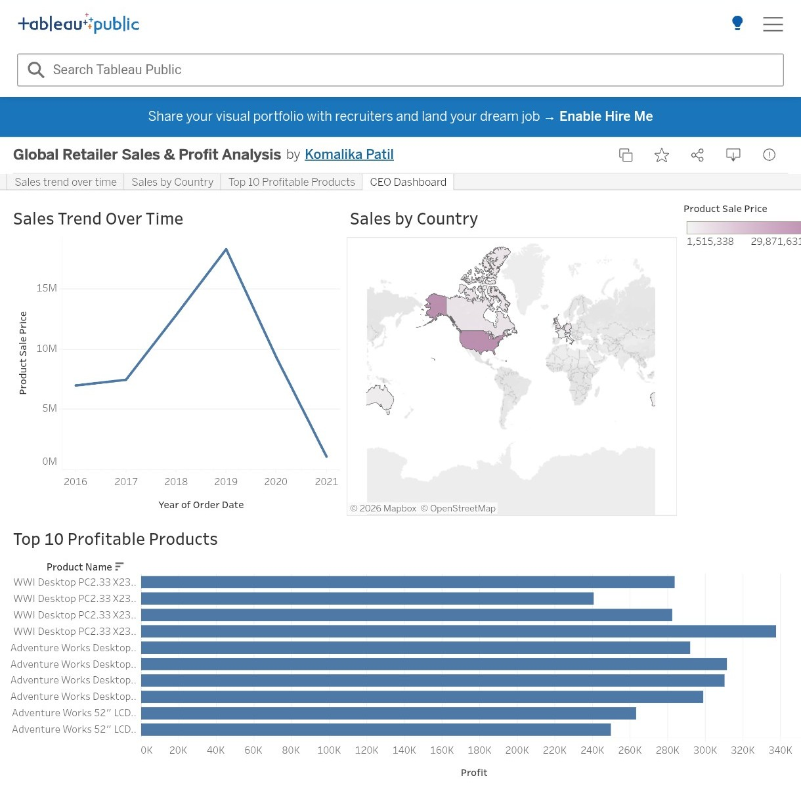

# 📊 Global Retailer Sales & Profit Dashboard

## 📌 Overview
This Tableau dashboard project analyzes global retailer sales and profit performance across different regions, categories, and time periods. It provides interactive visual insights to understand business trends and support data-driven decision-making.

---

## 📷 Dashboard Preview

---

## 🛠️ Tools Used
- Tableau
- Microsoft Excel (Data Source)

---

## 📊 Dashboard Features
- 📈 Sales performance analysis across regions and categories
- 💰 Profit analysis and comparison
- 🌍 Region-wise performance breakdown
- 📅 Monthly and yearly sales trend analysis
- 🏆 Identification of top-performing products and regions
- 🔍 Interactive filters for dynamic exploration

---

## 🔍 Key Insights
- Identified top-performing regions generating maximum sales and profit
- Observed seasonal trends in sales performance
- Found underperforming product categories
- Analyzed profit distribution across regions

---

## 🎯 Business Impact
- Supports data-driven decision making
- Helps identify growth opportunities
- Improves understanding of regional performance
- Assists in sales and profit optimization strategies

---

## 🔗 Live Dashboard
[View Tableau Dashboard](https://public.tableau.com/app/profile/komalika.patil/viz/GlobalRetailerSalesProfitAnalysis/CEODashboard)

---

## 🏁 Conclusion
This project provides a clear and interactive visualization of global retail performance, enabling better business insights and strategic decisions.
